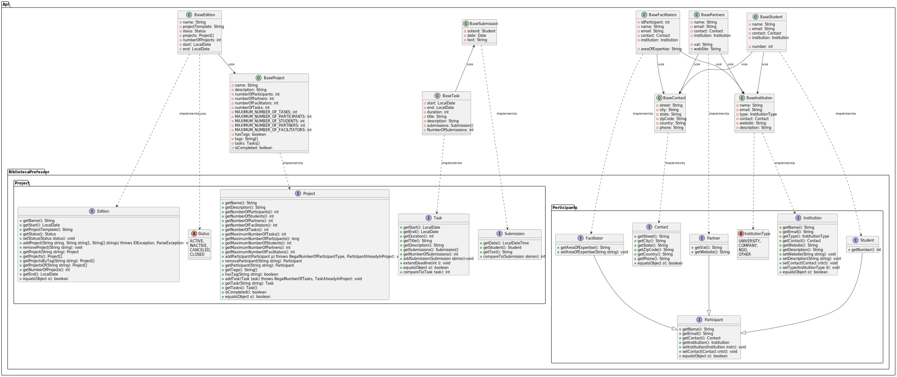

# PP_AC_8220307_8220337
Projeto criado em java para a cadeira de Paradigmas da Programação, no segundo semestre do primeiro ano. 

## Introdução: 
O Challenge Based Learning (CBL) é uma abordagem de ensino que tem como objetivo fornecer aos alunos a 
oportunidade de resolver problemas do mundo real de uma maneira prática e colaborativa. Através do CBL, os 
alunos são incentivados a trabalhar em equipa, identificar problemas e procurar soluções criativas.
Uma das principais características do CBL é o papel do facilitador. O facilitador é o responsável por guiar e apoiar 
os alunos durante todo o processo de aprendizagem, desde a identificação do problema até a implementação da 
solução. O facilitador é um mentor que incentiva os alunos a desenvolver habilidades como pensamento crítico, 
resolução de problemas e comunicação.
Além do facilitador, o CBL também envolve a colaboração com parceiros externos. Os parceiros podem ser 
empresas, organizações sem fins lucrativos, instituições de ensino superior, entre outros. Os parceiros fornecem 
aos alunos informações e recursos valiosos para ajudá-los a entender e resolver o problema em estudo.
O CBL também enfatiza a importância do trabalho em equipa. Os alunos são organizados em equipas para 
trabalhar em projetos específicos. Cada equipa é composta por alunos com diferentes habilidades e 
conhecimentos, o que ajuda a promover a diversidade e a criatividade. 
A cada edição do CBL, vários projetos são lançados. Cada projeto é uma sequência de tarefas que devem ser 
submetidas pelos alunos. As tarefas são projetadas para ajudar os alunos a desenvolver habilidades específicas, 
como a pesquisa, a análise de dados e a prototipagem. Ao final do projeto, os alunos devem apresentar sua 
solução para o problema que identificaram.

## Enunciado:
A API a desenvolver deverá ser capaz de suportar a gestão de edições de CBL (Edition), nomeadamente os seus 
projetos (Project), as tarefas associadas (Task) e a submissão de trabalhos (Submission) nas tarefas. Deve ainda 
suportar a gestão de participantes (Participant), sejam facilitadores (Facilitator), parceiros (Partner) ou estudantes 
(Student).

## Membros do Grupo:
 * Hugo Guimarães

 * Pedro Pinho

## Diagrama de Classe:

